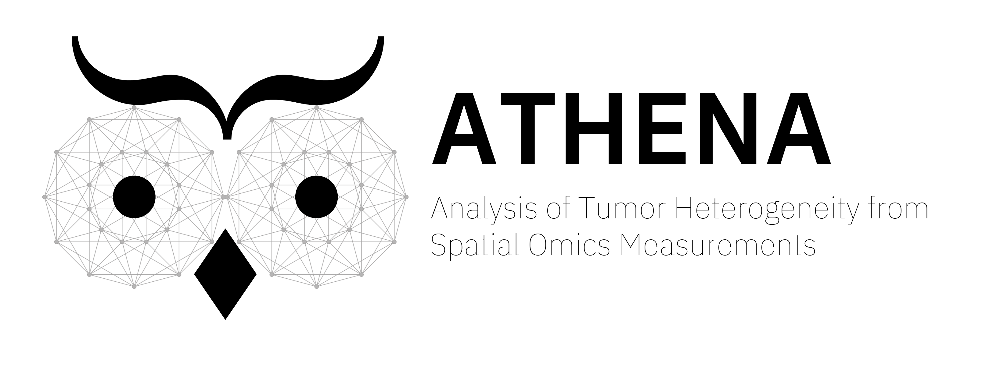
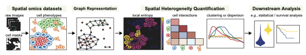

ATHENA is an open-source computational framework written in Python that facilitates the visualization, processing and analysis of (spatial) heterogeneity from spatial omics data. ATHENA supports any spatially resolved dataset that contains spatial transcriptomic or proteomic measurements, including Imaging Mass Cytometry (IMC), Multiplexed Ion Beam Imaging (MIBI), multiplexed Immunohistochemisty (mIHC) or Immunofluorescence (mIF), seqFISH, MERFISH, Visium.

## Main functionalities

1. ATHENA accomodates raw multiplexed images from spatial omics measurements. Together with the images, segmentation masks, cell-level, feature-level and sample-level annotations can be uploaded.

2. Based on the cell masks, ATHENA constructs graph representations of the data. The framework currently supports three flavors, namely radius, knn, and contact graphs.

3. ATHENA incorporates a variety of methods to quantify heterogeneity, such as global and local entropic scores. Furthermore, cell type interaction strength scores or measures of spatial clustering and dispersion.

4. Finally, the large collection of computed scores can be extracted and used as input in downstream machine learning models to perform tasks such as clinical data prediction, patient stratification or discovery of new (spatial) biomarkers.

# Installation
Install the package as outlined in the [docs](https://ai4scr.github.io/ATHENA/).
