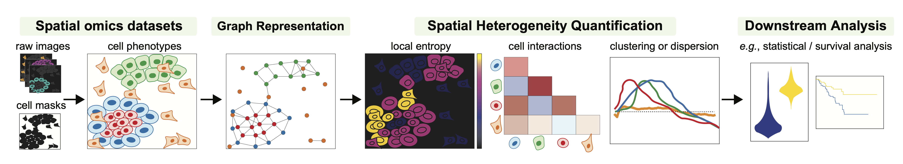

# ATHENA - Analysis of Tumor Heterogeneity in Spatial Omics Measurements

ATHENA is a computational framwork to analyse spatial heterogeneity in spatial single-cell omics data.

## Overview ATHENA
1. Spatially resolved omics measurements are acquired, resulting in highly dimensional images.

2. If necessary (for IMC, MIBI) images are segmented into single cells (cellmasks) and single cell expression values are extracted. Based on the single cell expression values, cells are classified into different type, aka phenotyping.

3. Cellmasks are used to construct a graph representation of the data. The framework currently supports three flavours (radius, knn, contact) that we will showcase later in this tutorial

4. The framework provides a variety of methods to quantify the observed diversity in samples. Furthermore, methods to analyse the interaction strength of different phenotypes are provided. 

5. The quantification methods can be used to featurise samples, this featurization can be used in downstream ML models to stratify patients and to discover new biomarkers.

# Installation
Install the package as outlined in the [docs](https://pages.github.ibm.com/art-zurich/spatial-heterogeneity).