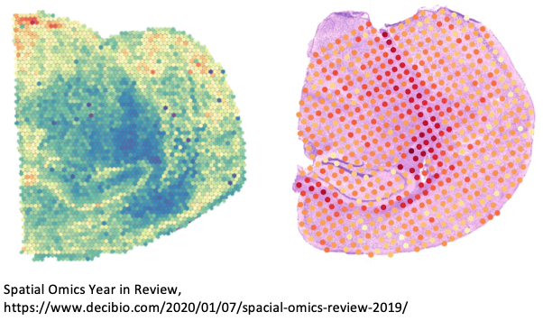

## Populate SpatialOmics instance

Spatial omics technologies are an emergent field and currently no standard libraries or data structures exists for handling the generated data in a consistent way. To facilitate the development of this framework we introduce the _SpatialOmics_ class. Since we work with high-dimensional images, memory complexity is a problem. _SpatialOmics_ stores data in a HDF5 file and lazily loads the required images on the fly to keep the memory consumption low.
The design of this class is inspred by _AnnData_, a class developed for the analysis of single-cell data sets.

**Objective**
- Data standard for consistent method development
- Technology-agnostic (resolutions, multiplexing and modalities )


**Attributes**

- **X**: Single-cell expression values (observations)
- **var**: Annotation of features in X

- **obs**: Annotation of observations

- **spl**: Annotation of samples

- **G**: Graph representation of observations

- **images**: Raw images

- **masks**: Segmentation masks

- **uns**: Unstructured data


**Data hierarchy**

- Sample-level information: patient features, acquisition details
- Observation-level information: expression levels, coordinates, phenotyping



```python
import tarfile
import tempfile
from skimage import io
import os
import pandas as pd
```


```python
from spatialOmics import SpatialOmics

# create empty instance
so = SpatialOmics()
```


```python
import urllib.request
import tarfile

# url from which we download example images
url = 'https://ndownloader.figshare.com/files/29006556'
filehandle, _ = urllib.request.urlretrieve(url)
```


```python
# extract images from tar archive
fimg = 'BaselTMA_SP41_15.475kx12.665ky_10000x8500_5_20170905_122_166_X15Y4_231_a0_full.tiff'
fmask = 'BaselTMA_SP41_15.475kx12.665ky_10000x8500_5_20170905_122_166_X15Y4_231_a0_full_maks.tiff'
fmeta = 'meta_data.csv'
root = 'spatialOmics-tutorial'

with tempfile.TemporaryDirectory() as tmpdir:
    with tarfile.open(filehandle, 'r:gz') as tar:
        tar.extractall(tmpdir)
        
        img = io.imread(os.path.join(tmpdir, root, fimg))
        mask = io.imread(os.path.join(tmpdir, root, fmask))
        meta = pd.read_csv(os.path.join(tmpdir, root, fmeta)).set_index('core')
        
        # set sample data of spatialOmics
        so.spl = meta[[fimg in i for i in meta.filename_fullstack]]
        
        # add high-dimensional tiff image
        so.add_image(so.spl.index[0], os.path.join(tmpdir, root, fimg), to_store=False)
        
        # add segmentation mask
        so.add_mask(so.spl.index[0], 'cellmasks', os.path.join(tmpdir, root, fmask), to_store=False)
```


```python
import spatialHeterogeneity as sh

# extract centroids of observations
sh.pp.extract_centroids(so, so.spl.index[0], mask_key='cellmasks')
```


```python
import numpy as np
from tqdm import tqdm

expr = so.images[so.spl.index[0]]
mask = so.masks[so.spl.index[0]]['cellmasks']

ids = np.unique(mask)
ids = ids[ids != 0]

# extract single-cell expression values
res = []
for i in tqdm(ids):
    res.append(expr[:, mask == i].mean(1))

# add single cell expression values to spatialOmics instance
so.X[so.spl.index[0]] = pd.DataFrame(np.stack(res, axis=0), index=ids)
```

    100%|██████████| 3066/3066 [00:03<00:00, 796.91it/s]

