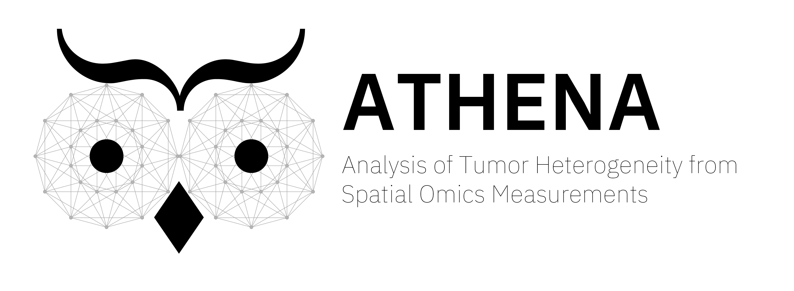

# Overview

ATHENA is an open-source computational framework written in Python that facilitates the visualization, processing and analysis of (spatial) heterogeneity from spatial omics data. ATHENA supports any spatially resolved dataset that contains spatial transcriptomic or proteomic measurements, including Imaging Mass Cytometry (IMC), Multiplexed Ion Beam Imaging (MIBI), multiplexed Immunohistochemisty (mIHC) or Immunofluorescence (mIF), seqFISH, MERFISH, Visium.

1. ATHENA accomodates raw multiplexed images from spatial omics measurements. Together with the images, segmentation masks, cell-level, feature-level and sample-level annotations can be uploaded.

2. Based on the cell masks, ATHENA constructs graph representations of the data. The framework currently supports three flavors, namely radius, knn, and contact graphs.

4. ATHENA incorporates a variety of methods to quantify heterogeneity, such as global and local entropic scores. Furthermore, cell type interaction strength scores or measures of spatial clustering and dispersion.

5. Finally, the large collection of computed scores can be extracted and used as input in downstream machine learning models to perform tasks such as clinical data prediction, patient stratification or discovery of new (spatial) biomarkers.

## Main components
- `SpatialOmics`, a new data structure inspired by [AnnData](https://anndata.readthedocs.io/en/latest/).  
- `SpatialHeterogeneity`, a module that enables the computation of various heterogeneity scores.

### `SpatialOmics` Data Structure
The `SpatialOmics` class is designed to accommodate storing and processing spatial omics datasets in a technology-agnostic and memory-efficient way. A `SpatialOmics` instance incorporates multiple attributes that bundle together the multiplexed raw images with the segmentation masks, cell-cell graphs, single-cell values, and sample-, feature- and cell-level annotations, as outlined in the figure below. Since ATHENA works with multiplexed images, memory complexity is a problem. `SpatialOmics` stores data in a HDF5 file and lazily loads the required images on the fly to keep the memory consumption low. The `SpatialOmics` structure is sample-centric, i.e., all samples from a spatial omics experiment are stored separately by heavily using Python dictionaries. 

Specifically, each `SpatialOmics` instance contains the following attributes:
1. `.images`: A Python dictionary (length: `#samples`) of raw multiplexed images, where each sample is mapped to a [numpy](https://numpy.org/) array of shape: `#features x image_width x image_height`.
2. `.masks`: A nested Python dictionary (length: `#samples`) supporting different types of segmentation masks (e.g., cell and tissue masks), where each sample is mapped to an inner dictionary (length: `#mask_types`), and each value of the inner dictionary is a binary [numpy](https://numpy.org/) array of shape: `#image_width x image_height`.
3. `.G`: A nested Python dictionary (length: `#samples`) supporting different topologies of graphs (e.g., knn, contact or radius graph), where each sample is mapped to an inner dictionary (length: `#graph_types`), and each value of the inner dictionary is a [networkx](https://networkx.org/) graph. 
4. `.X`: A Python dictionary of single-cell measurements (length: `#samples`), where each sample is mapped to a [pandas](https://pandas.pydata.org/) dataframe of shape: `#single_cells x #features`. The values in `.X` can either be uploaded or directly computed from `.images` and `.masks`.
5. `.spl`: A [pandas](https://pandas.pydata.org/) dataframe containing sample-level annotations (e.g., patient clinical data) of shape: `#samples x #annotations`.
6. `.obs`: A Python dictionary (length: `#samples`) containing single-cell-level annotations (e.g., cluster id, cell type, morphological fatures), where each sample is mapped to a [pandas](https://pandas.pydata.org/) dataframe of shape: `#single_cells x #annotations`. 
7. `.var`: A Python dictionary (length: `#samples`) containing feature-level annotations (e.g., name of protein/transcript), where each sample is mapped to a [pandas](https://pandas.pydata.org/) dataframe of shape: `#features x #annotations`. 
8. `.uns`: A Python dictionary containing unstructed data, e.g. various colormaps, experiment properties etc.

### `SpatialHeterogeneity` module

The `SpatialHeterogeneity` module is the heart of ATHENA that implements all visualization, processing and analysis steps integral to its functionalities. `SpatialHeterogeneity` consists in the following 5 submodules, each one performing different tasks as outlined below:

`SpatialHeterogeneity` is tightly interwoven with `SpatialOmics` (see figure below), in the sense that the submodules of `SpatialHeterogeneity` take as input various aspects of the data as stored in `SpatialOmics` (green arrows) and, at the same time, store computed outputs back into different attributes of `SpatialOmics` (purple arrows). 

1. `.pp` works with `.images` and .`masks` and facilitates image pre-processing functions, such as extraction of cell centroids. ATHENA requires segmentation masks to be provided by the user. For ideas on how to do that, see Further Resources.
2. `.pl` supports plotting all aspects of the data, including raw images, masks, graphs and visualizes different annotations as well as results of computed heterogeneity scores. The plots can be either static or interactive, by exploiting the Python image viewer [napari](https://napari.org/#).
3. `.graph` construct cell-cell graphs from the cell masks using three different graph builders: `kNN` (connects each cell with its _k_ closest neighbors), `radius` (connects each cell to all other cells within a radius $r$), and `contact` (connects cells that physically "touch" by first enlarging each mask by dilation and then connecting it to all other masks if there is overlap). The resulting graphs are saved back in the `.G` attribute of `SpatialOmics`.
4. `.metrics` uses the cell-cell graphs, the single-cell values (in `.X`) and cell annotations (in `.obs`) to compute a number of diversity scores, including sample richness (number of distinct cell subpopulations/clusters/clones) and abundance (relative proportions of species), and information theoretic scores, (namely Shannon, Simpson, quadratic, or Renyi entropy, Hill numbers), either at a global, sample level (saved in `.spl`), or at a local, single-cell-level (saved in `.obs`) that incorporates the spatial information. 
5. `.neigh` implements a number of neighborhood or spatial statistics methods, namely infiltration score, Ripley's $k$ and neighborhood analysis scores. Results are saved in `.spl` and `.uns`.
