# Tutorial on Imaging Mass Cytometry data 

In this tutorial we will showcase how ATHENA can be used to explore Imaging Mass Cytometry datasets. We will use the publicly available dataset of (Jackson et al., 2020 - [paper](https://www.nature.com/articles/s41586-019-1876-x)), where the authors used a panel of 35 cancer and immune markers to spatially profile the breast cancer ecosystem using Tissue Microarrays (TMAs) from two cohorts of breast cancer patients. 


## Import needed packages


```python
import athena as ath
import numpy as np
import pandas as pd
from tqdm import tqdm
from matplotlib import cm
import matplotlib.pyplot as plt
from matplotlib.colors import ListedColormap, Normalize
import seaborn as sns

pd.set_option('display.max_columns', 5)
```

## Load IMC data into a `SpatialOmics` object
Although the dataset consists of a total of 720 tumor images from 352 patients with breast cancer, for this tutorial, we will work with 8 random TMA cores from the _zurich_ cohort that can be easily loaded using the `.dataset` module of `Athena`:

Note: Download the latest version of the data set by setting `force_download=True`


```python
# so = ath.dataset.imc(force_download=True) # 10GB, might take some time the first time. Data is cached at ~/.cache/athena
so = ath.dataset.imc()
so
```

    INFO:numexpr.utils:NumExpr defaulting to 8 threads.


    warning: to get the latest version of this dataset use `so = sh.dataset.imc(force_download=True)`


    
    SpatialOmics object with n_obs 395769
        X: 347, (10, 3671) x (34, 34)
        spl: 347, ['pid', 'location', 'grade', 'tumor_type', 'tumor_size', 'gender', 'menopausal', 'PTNM_M', 'age', 'Patientstatus', 'treatment', 'PTNM_T', 'DiseaseStage', 'PTNM_N', 'AllSamplesSVSp4.Array', 'TMALocation', 'TMAxlocation', 'yLocation', 'DonorBlocklabel', 'diseasestatus', 'TMABlocklabel', 'UBTMAlocation', 'SupplierPatientID', 'Yearofsamplecollection', 'PrimarySite', 'histology', 'PTNM_Radicality', 'Lymphaticinvasion', 'Venousinvasion', 'ERStatus', 'PRStatus', 'HER2Status', 'Pre-surgeryTx', 'Post-surgeryTx', 'Tag', 'Ptdiagnosis', 'DFSmonth', 'OSmonth', 'Comment', 'ER+DuctalCa', 'TripleNegDuctal', 'hormonesensitive', 'hormonerefractory', 'hormoneresistantaftersenstive', 'Fulvestran', 'microinvasion', 'I_plus_neg', 'SN', 'MIC', 'Count_Cells', 'Height_FullStack', 'Width_FullStack', 'area', 'Subtype', 'HER2', 'ER', 'PR', 'clinical_type']
        obs: 347, {'core', 'id', 'phenograph_cluster', 'CellId', 'cell_type', 'cell_type_id', 'meta_label', 'meta_id'}
        var: 347, {'full_target_name', 'target', 'fullstack_index', 'channel', 'metal_tag', 'feature_type'}
        G: 7, {'knn', 'contact', 'radius'}
        masks: 347, {'cellmasks'}
        images: 347


## Explore `SpatialOmics` object

Various preprocessing steps (segmentation, single-cell quantification, phenotyping) have been applied to the data by the original authors and are included in the various attributes of the data. For example, `so.spl` contains sample-level metadata:


```python
print(so.spl.columns.values) #see all available sample annotations
so.spl.head(3) 
```

    ['pid' 'location' 'grade' 'tumor_type' 'tumor_size' 'gender' 'menopausal'
     'PTNM_M' 'age' 'Patientstatus' 'treatment' 'PTNM_T' 'DiseaseStage'
     'PTNM_N' 'AllSamplesSVSp4.Array' 'TMALocation' 'TMAxlocation' 'yLocation'
     'DonorBlocklabel' 'diseasestatus' 'TMABlocklabel' 'UBTMAlocation'
     'SupplierPatientID' 'Yearofsamplecollection' 'PrimarySite' 'histology'
     'PTNM_Radicality' 'Lymphaticinvasion' 'Venousinvasion' 'ERStatus'
     'PRStatus' 'HER2Status' 'Pre-surgeryTx' 'Post-surgeryTx' 'Tag'
     'Ptdiagnosis' 'DFSmonth' 'OSmonth' 'Comment' 'ER+DuctalCa'
     'TripleNegDuctal' 'hormonesensitive' 'hormonerefractory'
     'hormoneresistantaftersenstive' 'Fulvestran' 'microinvasion' 'I_plus_neg'
     'SN' 'MIC' 'Count_Cells' 'Height_FullStack' 'Width_FullStack' 'area'
     'Subtype' 'HER2' 'ER' 'PR' 'clinical_type']


<div>
<style scoped>
    .dataframe tbody tr th:only-of-type {
        vertical-align: middle;
    }

    .dataframe tbody tr th {
        vertical-align: top;
    }

    .dataframe thead th {
        text-align: right;
    }
</style>
<table border="1" class="dataframe">
  <thead>
    <tr style="text-align: right;">
      <th></th>
      <th>pid</th>
      <th>location</th>
      <th>...</th>
      <th>PR</th>
      <th>clinical_type</th>
    </tr>
    <tr>
      <th>core</th>
      <th></th>
      <th></th>
      <th></th>
      <th></th>
      <th></th>
    </tr>
  </thead>
  <tbody>
    <tr>
      <th>slide_49_By3x1</th>
      <td>49</td>
      <td>[]</td>
      <td>...</td>
      <td>+</td>
      <td>HR+HER2-</td>
    </tr>
    <tr>
      <th>slide_53_By11x8</th>
      <td>53</td>
      <td>PERIPHERY</td>
      <td>...</td>
      <td>NaN</td>
      <td>NaN</td>
    </tr>
    <tr>
      <th>slide_62_By9x5</th>
      <td>62</td>
      <td>[]</td>
      <td>...</td>
      <td>+</td>
      <td>HR+HER2-</td>
    </tr>
  </tbody>
</table>
<p>3 rows × 58 columns</p>
</div>


... and `so.obs` contains all single-cell level metadata:


```python
spl = 'slide_49_By2x5' #for one specific sample
print(so.obs[spl].columns.values) #see all available sample annotations
so.obs[spl].head(3) 
```

    ['core' 'meta_id' 'meta_label' 'cell_type_id' 'cell_type'
     'phenograph_cluster' 'CellId' 'id']


<div>
<style scoped>
    .dataframe tbody tr th:only-of-type {
        vertical-align: middle;
    }

    .dataframe tbody tr th {
        vertical-align: top;
    }

    .dataframe thead th {
        text-align: right;
    }
</style>
<table border="1" class="dataframe">
  <thead>
    <tr style="text-align: right;">
      <th></th>
      <th>core</th>
      <th>meta_id</th>
      <th>...</th>
      <th>CellId</th>
      <th>id</th>
    </tr>
    <tr>
      <th>cell_id</th>
      <th></th>
      <th></th>
      <th></th>
      <th></th>
      <th></th>
    </tr>
  </thead>
  <tbody>
    <tr>
      <th>1</th>
      <td>slide_49_By2x5</td>
      <td>11</td>
      <td>...</td>
      <td>1</td>
      <td>ZTMA208_slide_49_By2x5_1</td>
    </tr>
    <tr>
      <th>2</th>
      <td>slide_49_By2x5</td>
      <td>11</td>
      <td>...</td>
      <td>2</td>
      <td>ZTMA208_slide_49_By2x5_2</td>
    </tr>
    <tr>
      <th>3</th>
      <td>slide_49_By2x5</td>
      <td>11</td>
      <td>...</td>
      <td>3</td>
      <td>ZTMA208_slide_49_By2x5_3</td>
    </tr>
  </tbody>
</table>
<p>3 rows × 8 columns</p>
</div>


The `so.mask` attribute can store for each sample different segmentation masks. For this data set we have access to the segmentation into single cells (`cellmasks`).


```python
print(so.masks[spl].keys())
```

    dict_keys(['cellmasks'])


## Visualize raw images and masks
Run the cell below to launch the interactive [napari](https://napari.org) viewer and explore the multiplexed raw images. In addition to the single protein expression levels, we also add segmentations masks (with `add_masks`) for the single-cells.


```python
ath.pl.napari_viewer(so, spl, attrs=so.var[spl]['target'], add_masks=so.masks[spl].keys())
```

    INFO:OpenGL.acceleratesupport:No OpenGL_accelerate module loaded: No module named 'OpenGL_accelerate'


## Visualize single-cell data

### Set colormaps
First, let us set up a colormap and save it in the `.uns` attribute of the `SpatialOmics` instance, where it will be accessed by the `.pl` submodules when plotting certain features of the data. If no colormap is defined, the `.pl` module uses the ```default``` colormap (`so.uns['colormap']['default']`). The loaded dataset already comes with a phenotype classification for each single cell (`meta_id` in `.obs`) and a more coarse classification into main cell types (`cell_type_id` in `.obs`).


```python
# define default colormap
so.uns['cmaps'].update({'default': cm.Reds})

# set up colormaps for meta_id
cmap_paper = np.array([[255, 255, 255], [10, 141, 66], [62, 181, 86], [203, 224, 87],  # 0 1 2 3
                       [84, 108, 47], [180, 212, 50], [23, 101, 54],  # 4 5 6
                       [248, 232, 13], [1, 247, 252], [190, 252, 252],  # 7 8 9
                       [150, 210, 225], [151, 254, 255], [0, 255, 250],  # 10 11 12
                       [154, 244, 253], [19, 76, 144], [0, 2, 251],  # 13 14 15
                       [147, 213, 198], [67, 140, 114], [238, 70, 71],  # 16 17 18
                       [80, 45, 143], [135, 76, 158], [250, 179, 195],  # 19 20 21
                       [246, 108, 179], [207, 103, 43], [224, 162, 2],  # 22 23 24
                       [246, 131, 110], [135, 92, 43], [178, 33, 28]])


# define labels for meta_id
cmap_labels = {0: 'Background',
               1: 'B cells',
               2: 'B and T cells',
               3: 'T cell',
               4: 'Macrophages',
               5: 'T cell',
               6: 'Macrophages',
               7: 'Endothelial',
               8: 'Vimentin Hi',
               9: 'Small circular',
               10: 'Small elongated',
               11: 'Fibronectin Hi',
               12: 'Larger elongated',
               13: 'SMA Hi Vimentin',
               14: 'Hypoxic',
               15: 'Apopotic',
               16: 'Proliferative',
               17: 'p53 EGFR', 
               18: 'Basal CK',
               19: 'CK7 CK hi Cadherin',
               20: 'CK7 CK',
               21: 'Epithelial low',
               22: 'CK low HR low',                            
               23: 'HR hi CK',               
               24: 'CK HR', 
               25: 'HR low CK',                             
               27: 'Myoepithalial',
               26: 'CK low HR hi p53'}

so.uns['cmaps'].update({'meta_id': ListedColormap(cmap_paper / 255)})
so.uns['cmap_labels'].update({'meta_id': cmap_labels})

# cell_type_id colormap
cmap = ['white', 'darkgreen', 'gold', 'steelblue', 'darkred', 'coral']
cmap_labels = {0: 'background', 1: 'immune',  2: 'endothelial', 3: 'stromal', 4: 'tumor', 5: 'myoepithelial'}
cmap = ListedColormap(cmap)

so.uns['cmaps'].update({'cell_type_id': cmap})
so.uns['cmap_labels'].update({'cell_type_id': cmap_labels})
```

### Plot protein intensity or single-cell annotations 

Samples stored in the `SpatialOmics` object can be visualised with the plotting function `pl.spatial`.
In a first step we extract the centroids of each cell segmentation masks with `pp.extract_centroids` and store the results in the `SpatialOmics` instance (`so.obs[spl]`). This is required to enable the full plotting functionalities.


```python
print(so.masks[spl].keys())

# extract cell centroids across all samples
all_samples = ['slide_49_By2x5',
        'slide_59_Cy7x7',
        'slide_59_Cy7x8',
        'slide_59_Cy8x1',
        'slide_7_Cy2x2',
        'slide_7_Cy2x3',
        'slide_7_Cy2x4']
for spl in all_samples:
    ath.pp.extract_centroids(so, spl, mask_key='cellmasks')

# print results
print(so.obs[spl])
```

    dict_keys(['cellmasks'])
                      core meta_id  ...           y           x
    cell_id                         ...                        
    1        slide_7_Cy2x4      19  ...   11.344660   72.325243
    2        slide_7_Cy2x4      19  ...    2.346154   85.961538
    3        slide_7_Cy2x4      19  ...    1.142857  209.809524
    4        slide_7_Cy2x4      19  ...    3.769912  219.769912
    5        slide_7_Cy2x4      19  ...    1.375000  260.166667
    ...                ...     ...  ...         ...         ...
    1611     slide_7_Cy2x4       3  ...  518.425000  192.075000
    1612     slide_7_Cy2x4      19  ...  518.477612  233.283582
    1613     slide_7_Cy2x4      22  ...  520.000000  413.956522
    1614     slide_7_Cy2x4      22  ...  519.962963  421.962963
    1615     slide_7_Cy2x4       7  ...  514.229167  507.343750
    
    [1611 rows x 10 columns]


If only the `SpatialOmics` instance and the sample id is provided, the sample is plotted as a scatter plot using the computed centroids. However, with `mode=mask`, the computed segmentation masks are used. The observations can be colored according to a specific feature from `so.obs[spl]` or `so.X[spl]` - see example below.

Note: When plotting with `mode=mask` the plotted feature needs to be numeric.


```python
spl = 'slide_49_By2x5'
fig, axs = plt.subplots(2, 3, figsize=(15, 6), dpi=300)
ath.pl.spatial(so, spl, None, ax=axs.flat[0])
ath.pl.spatial(so, spl, 'cell_type_id', mode='mask', ax=axs.flat[1])
ath.pl.spatial(so, spl, 'meta_id', mode='mask', ax=axs.flat[2])
ath.pl.spatial(so, spl, 'CytokeratinPan', mode='mask', ax=axs.flat[3])
ath.pl.spatial(so, spl, 'Cytokeratin5', mode='mask', ax=axs.flat[4])
ath.pl.spatial(so, spl, 'SMA', mode='mask', ax=axs.flat[5])
```


    
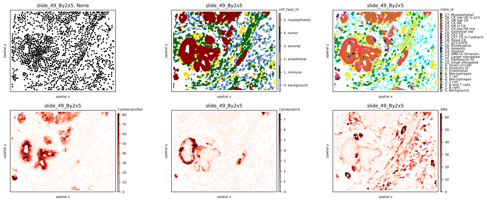
    


Experiment with different colormaps or background colors:


```python
so.uns['cmaps'].update({'default': cm.plasma})
fig, axs = plt.subplots(1, 3, figsize=(15, 3), dpi=100)
ath.pl.spatial(so, spl, 'CytokeratinPan', mode='mask', ax=axs.flat[0], background_color='black')
ath.pl.spatial(so, spl, 'Cytokeratin5', mode='mask', ax=axs.flat[1], background_color='black')
ath.pl.spatial(so, spl, 'SMA', mode='mask', ax=axs.flat[2], background_color='black')
```


    
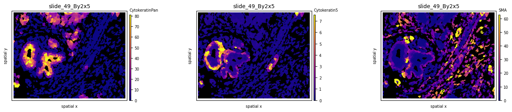
    


## Graph construction
Use the `.graph` submodule to construct 3 different graphs and experiment with the parameters (k, radius):

```python
# import default graph builder parameters
from athena.graph.constants import GRAPH_BUILDER_DEFAULT_PARAMS

# kNN graph
config = GRAPH_BUILDER_DEFAULT_PARAMS['knn']
config['builder_params']['n_neighbors'] = 6  # set parameter k
ath.graph.build_graph(so, spl, builder_type='knn', mask_key='cellmasks', config=config)

# radius graph
config = GRAPH_BUILDER_DEFAULT_PARAMS['radius']
config['builder_params']['radius'] = 20  # set radius
ath.graph.build_graph(so, spl, builder_type='radius', mask_key='cellmasks', config=config)

# contact graph - this takes some time
ath.graph.build_graph(so, spl, builder_type='contact', mask_key='cellmasks')

# the results are saved back into `.G`:
so.G[spl]
```

    100%|████████████████████████████████████████████████████████████████████████████████████████████████████████████████████████████████████████████████████████████| 1541/1541 [00:21<00:00, 71.42it/s]


    {'contact': <networkx.classes.graph.Graph at 0x7face1237d60>,
     'knn': <networkx.classes.graph.Graph at 0x7facd0867520>,
     'radius': <networkx.classes.graph.Graph at 0x7face1165730>}


The results can be plotted again using the `.pl.spatial` submodule. Notice how different graph builders result in graphs with different properties:


```python
fig, axs = plt.subplots(1, 3, figsize=(15, 6), dpi=100)
ath.pl.spatial(so, spl, 'meta_id', edges=True, graph_key='knn', ax=axs.flat[0], cbar=False)
ath.pl.spatial(so, spl, 'meta_id', edges=True, graph_key='radius', ax=axs.flat[1], cbar=False)
ath.pl.spatial(so, spl, 'meta_id', edges=True, graph_key='contact', ax=axs.flat[2], cbar=False)
```


    
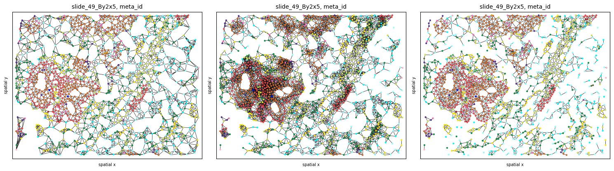
    


## Heterogeneity quantification

### Sample-level scores
Sample-level scores estimate a single heterogeneity score for the whole tumor, saved in `so.spl`. Although they ignore the spatial topology and cell-cell interactions, they describe the heterogeneity attrbuted to the number of cell types present and their frequencies. Below we show how to compute some of the included metrics across all 8 samples:


```python
# compute cell counts
so.spl['cell_count'] = [len(so.obs[s]) for s in so.obs.keys()]
so.spl['immune_cell_count'] = [np.sum(so.obs[s].cell_type == 'immune') for s in so.obs.keys()]

# compute metrics at a sample level
for s in all_samples:
    ath.metrics.richness(so, s, 'meta_id', local=False)
    ath.metrics.shannon(so, s, 'meta_id', local=False)

# estimated values are saved in so.spl    
so.spl.loc[all_samples, ['cell_count', 'richness_meta_id', 'shannon_meta_id']]
```


<div>
<style scoped>
    .dataframe tbody tr th:only-of-type {
        vertical-align: middle;
    }

    .dataframe tbody tr th {
        vertical-align: top;
    }

    .dataframe thead th {
        text-align: right;
    }
</style>
<table border="1" class="dataframe">
  <thead>
    <tr style="text-align: right;">
      <th></th>
      <th>cell_count</th>
      <th>richness_meta_id</th>
      <th>shannon_meta_id</th>
    </tr>
    <tr>
      <th>core</th>
      <th></th>
      <th></th>
      <th></th>
    </tr>
  </thead>
  <tbody>
    <tr>
      <th>slide_49_By2x5</th>
      <td>118</td>
      <td>19.0</td>
      <td>3.333942</td>
    </tr>
    <tr>
      <th>slide_59_Cy7x7</th>
      <td>1410</td>
      <td>13.0</td>
      <td>2.155000</td>
    </tr>
    <tr>
      <th>slide_59_Cy7x8</th>
      <td>1678</td>
      <td>15.0</td>
      <td>1.899001</td>
    </tr>
    <tr>
      <th>slide_59_Cy8x1</th>
      <td>556</td>
      <td>14.0</td>
      <td>2.305581</td>
    </tr>
    <tr>
      <th>slide_7_Cy2x2</th>
      <td>562</td>
      <td>15.0</td>
      <td>3.113132</td>
    </tr>
    <tr>
      <th>slide_7_Cy2x3</th>
      <td>1468</td>
      <td>13.0</td>
      <td>2.821626</td>
    </tr>
    <tr>
      <th>slide_7_Cy2x4</th>
      <td>1465</td>
      <td>19.0</td>
      <td>1.814858</td>
    </tr>
  </tbody>
</table>
</div>


To evaluate results, let's look at two samples (`slide_7_Cy2x2` and `slide_7_Cy2x4`) from the same patient (`pid`=7). Although they have similar cell counts and richness, their Shannon entropy values are markedly different, indicating higher heterogeneity for sample `slide_7_Cy2x2`:


```python
fig, axs = plt.subplots(1, 2, figsize=(10, 4), dpi=100)
ath.pl.spatial(so, 'slide_7_Cy2x4', 'meta_id', mode='mask', ax=axs.flat[0])
ath.pl.spatial(so, 'slide_7_Cy2x2', 'meta_id', mode='mask', ax=axs.flat[1])
```


    
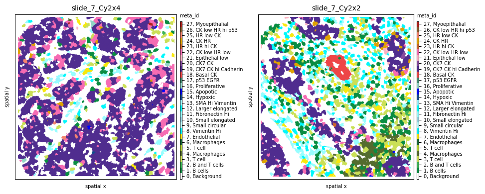
    


Indeed, we clearly see that while the first sample is dominated by one cell subpopulation (`CK7 CK hi Cadherin`), in the second sample the `meta_id` distribution is more spread, resulting in a higher Shannon index.


```python
fig = plt.figure(figsize=(15, 3))
plt.subplot(1, 2, 1)
sns.histplot(so.obs['slide_7_Cy2x4']['meta_label'])
plt.xticks(rotation=90)
plt.subplot(1, 2, 2)
sns.histplot(so.obs['slide_7_Cy2x2']['meta_label'])
plt.xticks(rotation=90)
plt.show()
```


    
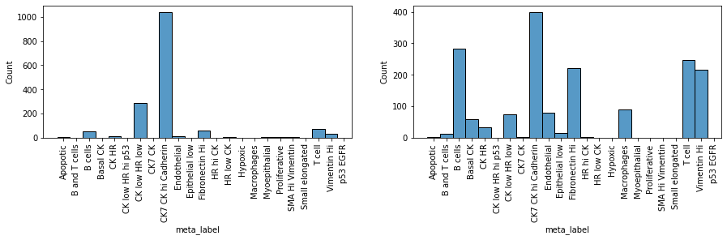
    


### Cell-level scores
Cell-level scores quantify heterogeneity in a spatial manner, accounting for local effects, and return a value per single cell, saved in `so.obs`. To apply these scores to the data we use again `.metrics` but this time with `local=True`.  Since these scores heavily depend on the tumor topology, the graph type and occasionally additional parameters also need to be provided.


```python
# compute metrics at a cell level for all samples - this will take some time
for s in tqdm(all_samples):
    ath.metrics.richness(so, s, 'meta_id', local=True, graph_key='contact')
    ath.metrics.shannon(so, s, 'meta_id', local=True, graph_key='contact')
    ath.metrics.quadratic_entropy(so, s, 'meta_id', local=True, graph_key='contact', metric='cosine')

# estimated values are saved in so.obs
so.obs[spl].columns
```

    100%|██████████████████████████████████████████████████████████████████████████████████████████████████████████████████████████████████████████████████████████████████| 7/7 [00:36<00:00,  5.24s/it]


    Index(['core', 'meta_id', 'meta_label', 'cell_type_id', 'cell_type',
           'phenograph_cluster', 'CellId', 'id', 'y', 'x',
           'richness_meta_id_contact', 'shannon_meta_id_contact',
           'quadratic_meta_id_contact'],
          dtype='object')


The results can be plotted again using the `.pl.spatial` submodule and passing the attribute we want to visualize. For example, let's observe the spatial heterogeneity of a random sample using three different metrics in the cell below. While local richness highlights tumor neighborhoods with multiple cell phenotypes present, local Shannon  also takes into consideration the proportions of these phenotypes. Finally, local quadratic entropy additionally takes into consideration the similarity between these phenotypes using the single-cell proteomic data stored in `.X`. Notice how, in the last subplot, only regions where cell phenotypes with very different profiles (e.g., tumor - immune - stromal) are highlighted.


```python
so.uns['cmaps'].update({'default': cm.plasma})

# visualize cell-level scores
spl='slide_49_By2x5'
fig, axs = plt.subplots(1, 4, figsize=(25, 12), dpi=300)
axs = axs.flat
ath.pl.spatial(so, spl, 'meta_id', mode='mask', ax=axs[0])
ath.pl.spatial(so, spl, 'richness_meta_id_contact', mode='mask', ax=axs[1], cbar_title=False, background_color='black')
ath.pl.spatial(so, spl, 'shannon_meta_id_contact', mode='mask', ax=axs[2], cbar_title=False, background_color='black')
ath.pl.spatial(so, spl, 'quadratic_meta_id_contact', mode='mask', ax=axs[3], cbar_title=False, background_color='black')
```


    
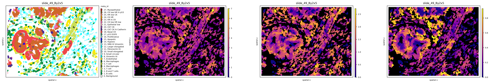
    


We can also observe how different graph topologies strongly influence the results:


```python
so.uns['cmaps'].update({'default': cm.plasma})

# try out different graph topologies
ath.metrics.quadratic_entropy(so, spl, 'meta_id', local=True, graph_key='radius')
ath.metrics.quadratic_entropy(so, spl, 'meta_id', local=True, graph_key='knn')

# visualize results
fig, axs = plt.subplots(1, 4, figsize=(25, 12), dpi=300)
axs = axs.flat
ath.pl.spatial(so, spl, 'meta_id', mode='mask', ax=axs[0])
ath.pl.spatial(so, spl, 'quadratic_meta_id_contact', mode='mask', ax=axs[1], cbar_title=False, background_color='black')
ath.pl.spatial(so, spl, 'quadratic_meta_id_radius', mode='mask', ax=axs[2], cbar_title=False, background_color='black')
ath.pl.spatial(so, spl, 'quadratic_meta_id_knn', mode='mask', ax=axs[3], cbar_title=False, background_color='black')
```


    
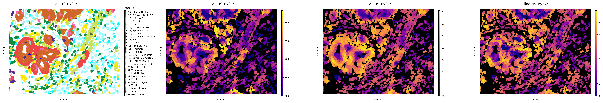
    


Since these scores are computed at the single-cell level, each tumor can now be represented by a *histogram* of values, as seen below for local quadratic entropy:


```python
fig = plt.figure(figsize=(25, 12))
for i,s in enumerate(all_samples):
    plt.subplot(2, 4, i+1)
    g=sns.histplot(so.obs[s]['quadratic_meta_id_contact'], stat='probability')
    g.set_title(s + ', median quad entropy = ' + str(round(so.obs[s]['quadratic_meta_id_contact'].median(),3)))
    plt.ylim([0,0.32])
    plt.xlim([0,1])
```


    
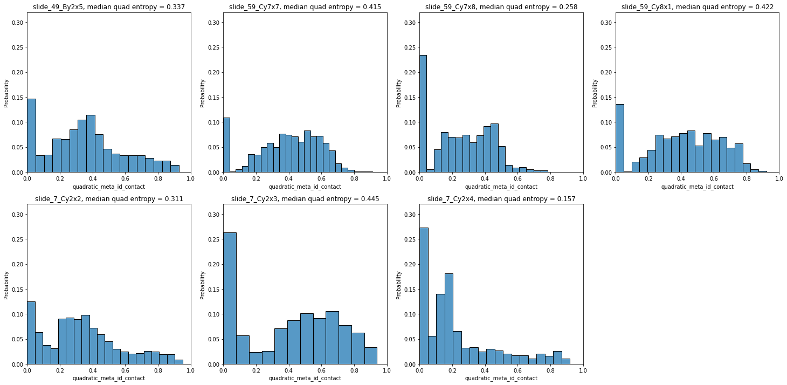
    


Let's plot two of the samples with the smallest and highest median quadratic entropy to evaluate the results. We clearly see that `slide_7_Cy2x4` is mostly homogeneous, with few highly entropic regions, and `slide_59_Cy7x7` is highly heterogeneous, as most areas contain mixtures of immune, stromal, endothelial and cancer cells. 


```python
fig, axs = plt.subplots(1, 4, figsize=(20, 8), dpi=100)
ath.pl.spatial(so, 'slide_7_Cy2x4', 'meta_id', mode='mask', ax=axs.flat[0])
ath.pl.spatial(so, 'slide_7_Cy2x4', 'quadratic_meta_id_contact', mode='mask', ax=axs.flat[1],
              cbar=False, background_color='black')
ath.pl.spatial(so, 'slide_59_Cy7x7', 'meta_id', mode='mask', ax=axs.flat[2])
ath.pl.spatial(so, 'slide_59_Cy7x7', 'quadratic_meta_id_contact', mode='mask', ax=axs.flat[3],
              cbar=False, background_color='black')

```


    
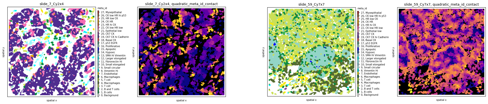
    


```python
# if needed, we can retrieve selected single-cell score values 
so.obs[spl].loc[:,['richness_meta_id_contact',
                   'shannon_meta_id_contact',
                   'quadratic_meta_id_contact']].head(5)
```


<div>
<style scoped>
    .dataframe tbody tr th:only-of-type {
        vertical-align: middle;
    }

    .dataframe tbody tr th {
        vertical-align: top;
    }

    .dataframe thead th {
        text-align: right;
    }
</style>
<table border="1" class="dataframe">
  <thead>
    <tr style="text-align: right;">
      <th></th>
      <th>richness_meta_id_contact</th>
      <th>shannon_meta_id_contact</th>
      <th>quadratic_meta_id_contact</th>
    </tr>
    <tr>
      <th>cell_id</th>
      <th></th>
      <th></th>
      <th></th>
    </tr>
  </thead>
  <tbody>
    <tr>
      <th>1</th>
      <td>1</td>
      <td>-0.000000</td>
      <td>1.110223e-16</td>
    </tr>
    <tr>
      <th>2</th>
      <td>1</td>
      <td>-0.000000</td>
      <td>1.110223e-16</td>
    </tr>
    <tr>
      <th>3</th>
      <td>1</td>
      <td>-0.000000</td>
      <td>1.110223e-16</td>
    </tr>
    <tr>
      <th>4</th>
      <td>2</td>
      <td>1.000000</td>
      <td>2.959280e-01</td>
    </tr>
    <tr>
      <th>5</th>
      <td>2</td>
      <td>0.811278</td>
      <td>2.388933e-01</td>
    </tr>
  </tbody>
</table>
</div>


### Immune infiltration
The infiltration score included in the `.neigh` submodule quantifies the degree of tumor-immune mixing (as defined in Keren, L. et al. - [paper](https://www.cell.com/cell/fulltext/S0092-8674(18)31100-0?_returnURL=https%3A%2F%2Flinkinghub.elsevier.com%2Fretrieve%2Fpii%2FS0092867418311000%3Fshowall%3Dtrue)). Let us compute it across all patients:


```python
for s in tqdm(all_samples):
    ath.neigh.infiltration(so, s, 'cell_type', graph_key='contact')

so.spl.loc[all_samples].infiltration
```

    100%|██████████████████████████████████████████████████████████████████████████████████████████████████████████████████████████████████████████████████████████████████| 7/7 [00:00<00:00, 33.60it/s]


    core
    slide_49_By2x5    0.144172
    slide_59_Cy7x7    0.128205
    slide_59_Cy7x8    0.195796
    slide_59_Cy8x1    0.182798
    slide_7_Cy2x2     0.067273
    slide_7_Cy2x3     0.106984
    slide_7_Cy2x4     0.611321
    Name: infiltration, dtype: float64


Now let's sort all samples by increasing immune infiltration:


```python
# sort samples by increasing infiltration
ind1=np.argsort(so.spl.loc[all_samples].infiltration.values)

# update colormap to show only immune and tumor cells 
cmap = ['white', 'darkgreen', 'lightgrey', 'lightgrey', 'darkred', 'lightgrey']
cmap_labels = {0: 'background', 1: 'immune',  2: 'endothelial', 3: 'stromal', 4: 'tumor', 5: 'myoepithelial'}
cmap = ListedColormap(cmap)
so.uns['cmaps'].update({'cell_type_id': cmap})
so.uns['cmap_labels'].update({'cell_type_id': cmap_labels})

fig, axs = plt.subplots(2, 4, figsize=(14, 7), dpi=300)
for i,s in enumerate(ind1):
    ath.pl.spatial(so, all_samples[s], 'cell_type_id', mode='mask', ax=axs.flat[i])
    d = so.spl.loc[all_samples[s]]
    axs.flat[i].set_title(f'Patient {d.pid}, infiltration: {d.infiltration:.2f}', fontdict={'size': 10})
axs.flat[-1].set_axis_off()
```


    
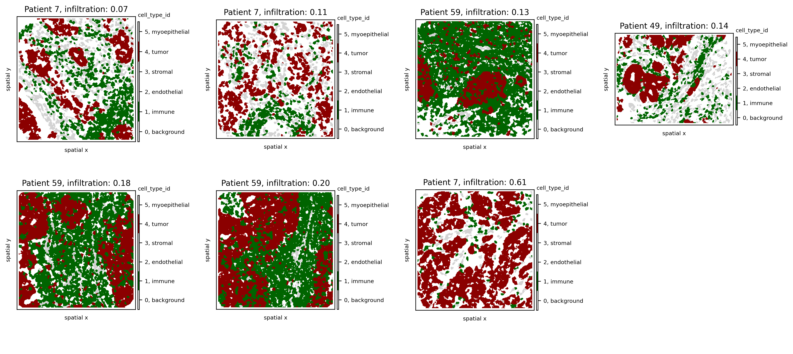
    


We observe that, as expected, as infiltration increases, immune cells penetrate more into the tumor area. One notable exception is the sample from Patient 7 with the highest infiltration score (0.55). Notice how, in this sample, the number of immune cells is much lower than that of tumor cells, resulting in multiple immune-tumor interactions by chance alone. Since the infiltration score is computed as the ratio of the number of tumor-immune interactions to immune-immune interactions, this high imbalance artificially inflates the infiltration score. 

In a next step we compute the infiltration on a cell-level. Since this method extracts the neighborhood subgraph of each cell it is recommended to use the `radius` graph representation with a reasonable radius.


```python
config = GRAPH_BUILDER_DEFAULT_PARAMS['radius']
config['builder_params']['radius'] = 36
ath.graph.build_graph(so, spl, builder_type='radius', config=config)

attr = 'cell_type'
ath.neigh.infiltration(so, spl, attr, graph_key='radius', local=True)
```

    100%|███████████████████████████████████████████████████████████████████████████████████████████████████████████████████████████████████████████████████████████| 1541/1541 [00:14<00:00, 106.59it/s]


```python
fig, axs = plt.subplots(1,3, figsize=(16,8))
ath.pl.spatial(so, spl, 'cell_type_id', ax=axs[0])
ath.pl.infiltration(so, spl, step_size= 10, ax=axs[1])
ath.pl.infiltration(so, spl, step_size= 5, ax=axs[2])
```

    WARNING:root:`step_size` is to granular, 271 observed infiltration values mapped to same grid square
    WARNING:root:computing mean for collisions
    WARNING:root:`step_size` is to granular, 6 observed infiltration values mapped to same grid square
    WARNING:root:computing mean for collisions


    
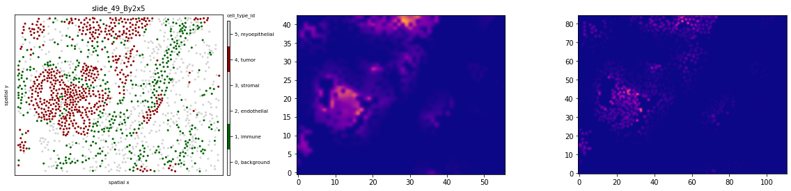
    


### Cell type interactions
We will then quantify tumor heterogeneity by looking into interactions between cell (pheno)types. First, let's compute the interaction strength using both the `meta_ids` and the `cell_type_ids` across all 8 samples using the `.neigh.interactions` submodule:


```python
import logging
logging.getLogger().setLevel(logging.ERROR)  # set logger to logging.INFO if you want to see more progress information

# this will take some time...
for s in tqdm(all_samples):
    ath.neigh.interactions(so, s, 'meta_id', mode='proportion', prediction_type='diff', graph_key='contact', try_load=False);
    ath.neigh.interactions(so, s, 'cell_type_id', mode='proportion', prediction_type='diff', graph_key='contact', try_load=False);
```

      0%|                                                                                                                                                                          | 0/7 [00:00<?, ?it/s]

    Wed Jun 29 16:32:32 2022: 10/100, duration: 0.29) sec
    Wed Jun 29 16:32:34 2022: 20/100, duration: 0.29) sec
    Wed Jun 29 16:32:37 2022: 30/100, duration: 0.29) sec
    Wed Jun 29 16:32:40 2022: 40/100, duration: 0.29) sec
    Wed Jun 29 16:32:43 2022: 50/100, duration: 0.29) sec
    Wed Jun 29 16:32:46 2022: 60/100, duration: 0.28) sec
    Wed Jun 29 16:32:49 2022: 70/100, duration: 0.28) sec
    Wed Jun 29 16:32:51 2022: 80/100, duration: 0.28) sec
    Wed Jun 29 16:32:54 2022: 90/100, duration: 0.28) sec
    Wed Jun 29 16:32:57 2022: 100/100, duration: 0.28) sec
    Wed Jun 29 16:32:57 2022: Finished, duration: 0.47 min (0.28sec/it)
    Wed Jun 29 16:32:58 2022: 10/100, duration: 0.09) sec
    Wed Jun 29 16:32:59 2022: 20/100, duration: 0.11) sec
    Wed Jun 29 16:33:00 2022: 30/100, duration: 0.10) sec
    Wed Jun 29 16:33:02 2022: 40/100, duration: 0.11) sec
    Wed Jun 29 16:33:03 2022: 50/100, duration: 0.11) sec
    Wed Jun 29 16:33:04 2022: 60/100, duration: 0.11) sec
    Wed Jun 29 16:33:05 2022: 70/100, duration: 0.11) sec
    Wed Jun 29 16:33:06 2022: 80/100, duration: 0.10) sec
    Wed Jun 29 16:33:07 2022: 90/100, duration: 0.11) sec


     14%|███████████████████████▏                                                                                                                                          | 1/7 [00:39<03:57, 39.50s/it]

    Wed Jun 29 16:33:08 2022: 100/100, duration: 0.11) sec
    Wed Jun 29 16:33:08 2022: Finished, duration: 0.18 min (0.11sec/it)
    Wed Jun 29 16:33:11 2022: 10/100, duration: 0.30) sec
    Wed Jun 29 16:33:15 2022: 20/100, duration: 0.31) sec
    Wed Jun 29 16:33:18 2022: 30/100, duration: 0.31) sec
    Wed Jun 29 16:33:21 2022: 40/100, duration: 0.32) sec
    Wed Jun 29 16:33:24 2022: 50/100, duration: 0.31) sec
    Wed Jun 29 16:33:27 2022: 60/100, duration: 0.32) sec
    Wed Jun 29 16:33:31 2022: 70/100, duration: 0.32) sec
    Wed Jun 29 16:33:34 2022: 80/100, duration: 0.32) sec
    Wed Jun 29 16:33:37 2022: 90/100, duration: 0.32) sec
    Wed Jun 29 16:33:40 2022: 100/100, duration: 0.32) sec
    Wed Jun 29 16:33:40 2022: Finished, duration: 0.53 min (0.32sec/it)
    Wed Jun 29 16:33:41 2022: 10/100, duration: 0.07) sec
    Wed Jun 29 16:33:42 2022: 20/100, duration: 0.07) sec
    Wed Jun 29 16:33:42 2022: 30/100, duration: 0.07) sec
    Wed Jun 29 16:33:43 2022: 40/100, duration: 0.07) sec
    Wed Jun 29 16:33:44 2022: 50/100, duration: 0.07) sec
    Wed Jun 29 16:33:44 2022: 60/100, duration: 0.07) sec
    Wed Jun 29 16:33:45 2022: 70/100, duration: 0.07) sec
    Wed Jun 29 16:33:45 2022: 80/100, duration: 0.06) sec
    Wed Jun 29 16:33:46 2022: 90/100, duration: 0.06) sec


     29%|██████████████████████████████████████████████▎                                                                                                                   | 2/7 [01:18<03:15, 39.14s/it]

    Wed Jun 29 16:33:47 2022: 100/100, duration: 0.06) sec
    Wed Jun 29 16:33:47 2022: Finished, duration: 0.11 min (0.06sec/it)
    Wed Jun 29 16:33:51 2022: 10/100, duration: 0.36) sec
    Wed Jun 29 16:33:55 2022: 20/100, duration: 0.37) sec
    Wed Jun 29 16:33:58 2022: 30/100, duration: 0.37) sec
    Wed Jun 29 16:34:02 2022: 40/100, duration: 0.37) sec
    Wed Jun 29 16:34:06 2022: 50/100, duration: 0.37) sec
    Wed Jun 29 16:34:10 2022: 60/100, duration: 0.37) sec
    Wed Jun 29 16:34:13 2022: 70/100, duration: 0.37) sec
    Wed Jun 29 16:34:17 2022: 80/100, duration: 0.37) sec
    Wed Jun 29 16:34:21 2022: 90/100, duration: 0.37) sec
    Wed Jun 29 16:34:25 2022: 100/100, duration: 0.38) sec
    Wed Jun 29 16:34:25 2022: Finished, duration: 0.63 min (0.38sec/it)
    Wed Jun 29 16:34:26 2022: 10/100, duration: 0.07) sec
    Wed Jun 29 16:34:27 2022: 20/100, duration: 0.07) sec
    Wed Jun 29 16:34:27 2022: 30/100, duration: 0.07) sec
    Wed Jun 29 16:34:28 2022: 40/100, duration: 0.08) sec
    Wed Jun 29 16:34:29 2022: 50/100, duration: 0.07) sec
    Wed Jun 29 16:34:30 2022: 60/100, duration: 0.07) sec
    Wed Jun 29 16:34:30 2022: 70/100, duration: 0.07) sec
    Wed Jun 29 16:34:31 2022: 80/100, duration: 0.07) sec
    Wed Jun 29 16:34:32 2022: 90/100, duration: 0.07) sec


     43%|█████████████████████████████████████████████████████████████████████▍                                                                                            | 3/7 [02:03<02:48, 42.06s/it]

    Wed Jun 29 16:34:32 2022: 100/100, duration: 0.07) sec
    Wed Jun 29 16:34:32 2022: Finished, duration: 0.12 min (0.07sec/it)
    Wed Jun 29 16:34:36 2022: 10/100, duration: 0.34) sec
    Wed Jun 29 16:34:39 2022: 20/100, duration: 0.34) sec
    Wed Jun 29 16:34:43 2022: 30/100, duration: 0.33) sec
    Wed Jun 29 16:34:46 2022: 40/100, duration: 0.33) sec
    Wed Jun 29 16:34:49 2022: 50/100, duration: 0.33) sec
    Wed Jun 29 16:34:53 2022: 60/100, duration: 0.34) sec
    Wed Jun 29 16:34:56 2022: 70/100, duration: 0.34) sec
    Wed Jun 29 16:35:00 2022: 80/100, duration: 0.34) sec
    Wed Jun 29 16:35:03 2022: 90/100, duration: 0.34) sec
    Wed Jun 29 16:35:07 2022: 100/100, duration: 0.34) sec
    Wed Jun 29 16:35:07 2022: Finished, duration: 0.57 min (0.34sec/it)
    Wed Jun 29 16:35:07 2022: 10/100, duration: 0.07) sec
    Wed Jun 29 16:35:08 2022: 20/100, duration: 0.07) sec
    Wed Jun 29 16:35:09 2022: 30/100, duration: 0.06) sec
    Wed Jun 29 16:35:09 2022: 40/100, duration: 0.06) sec
    Wed Jun 29 16:35:10 2022: 50/100, duration: 0.06) sec
    Wed Jun 29 16:35:11 2022: 60/100, duration: 0.06) sec
    Wed Jun 29 16:35:11 2022: 70/100, duration: 0.06) sec
    Wed Jun 29 16:35:12 2022: 80/100, duration: 0.06) sec
    Wed Jun 29 16:35:12 2022: 90/100, duration: 0.06) sec


     57%|████████████████████████████████████████████████████████████████████████████████████████████▌                                                                     | 4/7 [02:44<02:04, 41.54s/it]

    Wed Jun 29 16:35:13 2022: 100/100, duration: 0.06) sec
    Wed Jun 29 16:35:13 2022: Finished, duration: 0.10 min (0.06sec/it)
    Wed Jun 29 16:35:16 2022: 10/100, duration: 0.24) sec
    Wed Jun 29 16:35:18 2022: 20/100, duration: 0.23) sec
    Wed Jun 29 16:35:20 2022: 30/100, duration: 0.23) sec
    Wed Jun 29 16:35:22 2022: 40/100, duration: 0.23) sec
    Wed Jun 29 16:35:26 2022: 50/100, duration: 0.25) sec
    Wed Jun 29 16:35:28 2022: 60/100, duration: 0.25) sec
    Wed Jun 29 16:35:31 2022: 70/100, duration: 0.25) sec
    Wed Jun 29 16:35:33 2022: 80/100, duration: 0.25) sec
    Wed Jun 29 16:35:35 2022: 90/100, duration: 0.25) sec
    Wed Jun 29 16:35:38 2022: 100/100, duration: 0.25) sec
    Wed Jun 29 16:35:38 2022: Finished, duration: 0.41 min (0.25sec/it)
    Wed Jun 29 16:35:39 2022: 10/100, duration: 0.06) sec
    Wed Jun 29 16:35:39 2022: 20/100, duration: 0.05) sec
    Wed Jun 29 16:35:39 2022: 30/100, duration: 0.04) sec
    Wed Jun 29 16:35:40 2022: 40/100, duration: 0.05) sec
    Wed Jun 29 16:35:40 2022: 50/100, duration: 0.04) sec
    Wed Jun 29 16:35:40 2022: 60/100, duration: 0.04) sec
    Wed Jun 29 16:35:41 2022: 70/100, duration: 0.05) sec
    Wed Jun 29 16:35:41 2022: 80/100, duration: 0.04) sec
    Wed Jun 29 16:35:42 2022: 90/100, duration: 0.04) sec


     71%|███████████████████████████████████████████████████████████████████████████████████████████████████████████████████▋                                              | 5/7 [03:14<01:14, 37.17s/it]

    Wed Jun 29 16:35:42 2022: 100/100, duration: 0.04) sec
    Wed Jun 29 16:35:42 2022: Finished, duration: 0.07 min (0.04sec/it)
    Wed Jun 29 16:35:44 2022: 10/100, duration: 0.15) sec
    Wed Jun 29 16:35:46 2022: 20/100, duration: 0.16) sec
    Wed Jun 29 16:35:48 2022: 30/100, duration: 0.16) sec
    Wed Jun 29 16:35:49 2022: 40/100, duration: 0.16) sec
    Wed Jun 29 16:35:51 2022: 50/100, duration: 0.16) sec
    Wed Jun 29 16:35:52 2022: 60/100, duration: 0.16) sec
    Wed Jun 29 16:35:54 2022: 70/100, duration: 0.16) sec
    Wed Jun 29 16:35:56 2022: 80/100, duration: 0.16) sec
    Wed Jun 29 16:35:57 2022: 90/100, duration: 0.16) sec
    Wed Jun 29 16:35:59 2022: 100/100, duration: 0.16) sec
    Wed Jun 29 16:35:59 2022: Finished, duration: 0.27 min (0.16sec/it)
    Wed Jun 29 16:35:59 2022: 10/100, duration: 0.03) sec
    Wed Jun 29 16:36:00 2022: 20/100, duration: 0.03) sec
    Wed Jun 29 16:36:00 2022: 30/100, duration: 0.03) sec
    Wed Jun 29 16:36:00 2022: 40/100, duration: 0.04) sec
    Wed Jun 29 16:36:01 2022: 50/100, duration: 0.03) sec
    Wed Jun 29 16:36:01 2022: 60/100, duration: 0.03) sec
    Wed Jun 29 16:36:01 2022: 70/100, duration: 0.03) sec
    Wed Jun 29 16:36:02 2022: 80/100, duration: 0.04) sec
    Wed Jun 29 16:36:02 2022: 90/100, duration: 0.04) sec


     86%|██████████████████████████████████████████████████████████████████████████████████████████████████████████████████████████████████████████▊                       | 6/7 [03:34<00:31, 31.36s/it]

    Wed Jun 29 16:36:02 2022: 100/100, duration: 0.03) sec
    Wed Jun 29 16:36:02 2022: Finished, duration: 0.06 min (0.03sec/it)
    Wed Jun 29 16:36:05 2022: 10/100, duration: 0.26) sec
    Wed Jun 29 16:36:08 2022: 20/100, duration: 0.27) sec
    Wed Jun 29 16:36:11 2022: 30/100, duration: 0.27) sec
    Wed Jun 29 16:36:13 2022: 40/100, duration: 0.27) sec
    Wed Jun 29 16:36:16 2022: 50/100, duration: 0.26) sec
    Wed Jun 29 16:36:19 2022: 60/100, duration: 0.26) sec
    Wed Jun 29 16:36:21 2022: 70/100, duration: 0.26) sec
    Wed Jun 29 16:36:24 2022: 80/100, duration: 0.26) sec
    Wed Jun 29 16:36:26 2022: 90/100, duration: 0.26) sec
    Wed Jun 29 16:36:29 2022: 100/100, duration: 0.26) sec
    Wed Jun 29 16:36:29 2022: Finished, duration: 0.44 min (0.26sec/it)
    Wed Jun 29 16:36:30 2022: 10/100, duration: 0.07) sec
    Wed Jun 29 16:36:31 2022: 20/100, duration: 0.08) sec
    Wed Jun 29 16:36:32 2022: 30/100, duration: 0.08) sec
    Wed Jun 29 16:36:33 2022: 40/100, duration: 0.08) sec
    Wed Jun 29 16:36:33 2022: 50/100, duration: 0.08) sec
    Wed Jun 29 16:36:34 2022: 60/100, duration: 0.08) sec
    Wed Jun 29 16:36:35 2022: 70/100, duration: 0.08) sec
    Wed Jun 29 16:36:36 2022: 80/100, duration: 0.08) sec
    Wed Jun 29 16:36:37 2022: 90/100, duration: 0.08) sec


    100%|██████████████████████████████████████████████████████████████████████████████████████████████████████████████████████████████████████████████████████████████████| 7/7 [04:08<00:00, 35.55s/it]

    Wed Jun 29 16:36:37 2022: 100/100, duration: 0.08) sec
    Wed Jun 29 16:36:37 2022: Finished, duration: 0.13 min (0.08sec/it)


    


Let's look at the results for sample `slide_7_Cy2x4` below. We notice multiple interactions between the few immune, stromal and endothelial cells (red squares in the first 13 rows and columns). At the same time, most of these cell phenotypes strongly avoid the dominant tumor cell population `19`, indicated by the blue squares in its respective column.


```python
norm = Normalize(-.3, .3)
fig, axs = plt.subplots(1, 2, figsize=(15, 6), dpi=100)
ath.pl.spatial(so, 'slide_7_Cy2x4', 'meta_id', mode='mask', ax=axs[0])
ath.pl.interactions(so, 'slide_7_Cy2x4', 'meta_id', mode='proportion', prediction_type='diff', graph_key='contact', ax=axs[1],
                   norm=norm)
```


    
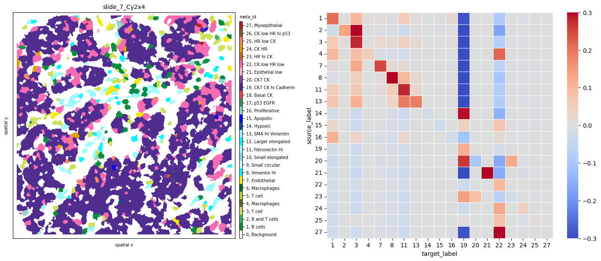
    


Observing sample `slide_7_Cy2x2` from the same patient `7` shows again the same immune, endothelial and stromal co-occurence, but this time we notice strongly self-clustered tumor phenotypes (`18`).


```python
fig, axs = plt.subplots(1, 2, figsize=(15, 6), dpi=100)
ath.pl.spatial(so, 'slide_7_Cy2x2', 'meta_id', mode='mask', ax=axs[0])
ath.pl.interactions(so, 'slide_7_Cy2x2', 'meta_id', mode='proportion', prediction_type='diff', graph_key='contact', ax=axs[1],
                   norm=norm)

fig.tight_layout()
# fig.show()
```


    
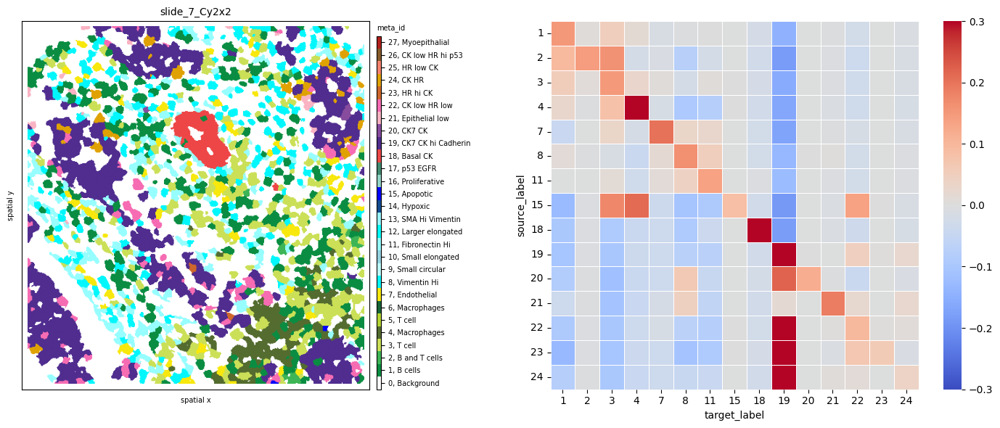
    


Last, these interaction matrices can also be visualized per `cell_type_ids`, as shown below, where we clearly see again how all immune, stromal and endothelial cells of sample `slide_7_Cy2x4` strongly avoid all tumor cells.


```python
# cell_type_id colormap
cmap = ['white', 'darkgreen', 'gold', 'steelblue', 'darkred', 'coral']
cmap_labels = {0: 'background', 1: 'immune',  2: 'endothelial', 3: 'stromal', 4: 'tumor', 5: 'myoepithelial'}
cmap = ListedColormap(cmap)

so.uns['cmaps'].update({'cell_type_id': cmap})
so.uns['cmap_labels'].update({'cell_type_id': cmap_labels})

fig, axs = plt.subplots(1, 2, figsize=(15, 6), dpi=300)
ath.pl.spatial(so, 'slide_7_Cy2x4', 'cell_type_id', mode='mask', ax=axs[0])
norm = Normalize(-.3, .3)
ath.pl.interactions(so, 'slide_7_Cy2x4', 'cell_type_id', mode='proportion', prediction_type='diff', graph_key='contact', ax=axs[1])
fig.tight_layout()
# fig.show()
```


    
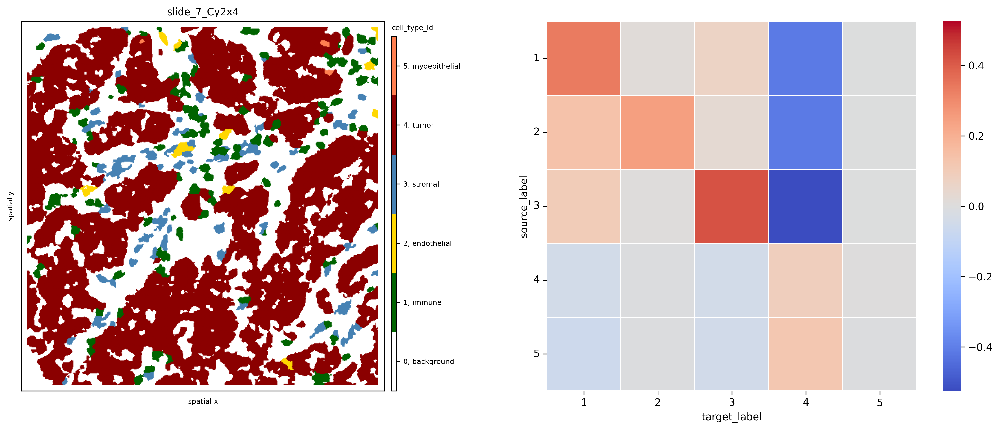
    


Last, we can use the interaction score of immune to tumor cells to sort our samples by increasing attraction:


```python
mixing_score=[]
for s in all_samples:
    interaction_res = so.uns[s]['interactions']['cell_type_id_proportion_diff_contact'] # get interaction results
    diff = interaction_res.loc[1].loc[4]['diff'] # interactions between source id 1 (immune), target id 4 (tumor)
    mixing_score.append(diff)

# cell_type_id colormap
cmap = ['white', 'darkgreen', 'lightgrey', 'lightgrey', 'darkred', 'lightgrey']
cmap_labels = {0: 'background', 1: 'immune',  2: 'endothelial', 3: 'stromal', 4: 'tumor', 5: 'myoepithelial'}
cmap = ListedColormap(cmap)
so.uns['cmaps'].update({'cell_type_id': cmap})
so.uns['cmap_labels'].update({'cell_type_id': cmap_labels})

ind=np.argsort(mixing_score)

fig, axs = plt.subplots(2, 4, figsize=(14, 7), dpi=300)
for i,s in enumerate(ind):
    ath.pl.spatial(so, all_samples[s], 'cell_type_id', mode='mask', ax=axs.flat[i])

axs.flat[-1].set_axis_off()
```


    
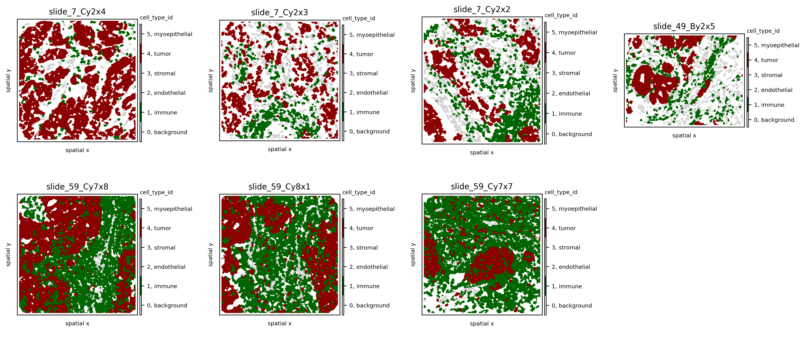
    


### Ripley's K
Ripley’s $K(t)$ function is used to analyse spatial point processes, i.e., if observed events are regularly dis- tributed in space. The computational framework implements this metric to give insight in whether a certain cell type clusters at different spatial scales or not. Often it is usefull to look at the variance stabilising transform $L(t)$ which is expected to be equal to $t$ under a homogeneous Poisson process.

In a frist step we need to compute the widht, height and area of the samples because this is used to determine the different radii at which Ripley's K is computed as well as for edge-corrections of the values.


```python
so.spl.loc[all_samples]
```


<div>
<style scoped>
    .dataframe tbody tr th:only-of-type {
        vertical-align: middle;
    }

    .dataframe tbody tr th {
        vertical-align: top;
    }

    .dataframe thead th {
        text-align: right;
    }
</style>
<table border="1" class="dataframe">
  <thead>
    <tr style="text-align: right;">
      <th></th>
      <th>pid</th>
      <th>location</th>
      <th>...</th>
      <th>shannon_meta_id</th>
      <th>infiltration</th>
    </tr>
    <tr>
      <th>core</th>
      <th></th>
      <th></th>
      <th></th>
      <th></th>
      <th></th>
    </tr>
  </thead>
  <tbody>
    <tr>
      <th>slide_49_By2x5</th>
      <td>49</td>
      <td>CENTER</td>
      <td>...</td>
      <td>3.333942</td>
      <td>0.144172</td>
    </tr>
    <tr>
      <th>slide_59_Cy7x7</th>
      <td>59</td>
      <td>CENTER</td>
      <td>...</td>
      <td>2.155000</td>
      <td>0.128205</td>
    </tr>
    <tr>
      <th>slide_59_Cy7x8</th>
      <td>59</td>
      <td>CENTER</td>
      <td>...</td>
      <td>1.899001</td>
      <td>0.195796</td>
    </tr>
    <tr>
      <th>slide_59_Cy8x1</th>
      <td>59</td>
      <td>PERIPHERY</td>
      <td>...</td>
      <td>2.305581</td>
      <td>0.182798</td>
    </tr>
    <tr>
      <th>slide_7_Cy2x2</th>
      <td>7</td>
      <td>CENTER</td>
      <td>...</td>
      <td>3.113132</td>
      <td>0.067273</td>
    </tr>
    <tr>
      <th>slide_7_Cy2x3</th>
      <td>7</td>
      <td>CENTER</td>
      <td>...</td>
      <td>2.821626</td>
      <td>0.106984</td>
    </tr>
    <tr>
      <th>slide_7_Cy2x4</th>
      <td>7</td>
      <td>PERIPHERY</td>
      <td>...</td>
      <td>1.814858</td>
      <td>0.611321</td>
    </tr>
  </tbody>
</table>
<p>7 rows × 63 columns</p>
</div>


```python
widths = []
heights = []
for s in so.spl.index:
    heights.append(so.images[s].shape[1])
    widths.append(so.images[s].shape[2])
    
widths, heights = np.array(widths), np.array(heights)
areas = widths * heights

so.spl.loc[:, 'width'] = widths
so.spl.loc[:, 'height'] = heights
so.spl.loc[:, 'area'] = areas
```


```python
# compute estimated deviation from random poisson process L(t)-t 
spl = 'slide_7_Cy2x2'
spl = 'slide_49_By2x5'
attr = 'meta_id'
radii = np.linspace(0,400,100)
for _id in so.obs[spl][attr].unique(): 
    if 'x' not in so.obs[spl] and 'y' not in so.obs[spl]:
        ath.pp.extract_centroids(so, spl)
    ath.neigh.ripleysK(so, spl, attr, _id, mode='csr-deviation', radii=radii)
```


```python
cmap = ['white', 'darkgreen', 'gold', 'steelblue', 'darkred', 'coral']
cmap_labels = {0: 'background', 1: 'immune',  2: 'endothelial', 3: 'stromal', 4: 'tumor', 5: 'myoepithelial'}
cmap = ListedColormap(cmap)
so.uns['cmaps'].update({'cell_type_id': cmap})
so.uns['cmap_labels'].update({'cell_type_id': cmap_labels})

# plot estimated deviation from random poisson process L(t)-t 
fig, axs = plt.subplots(1,2,figsize=(12,4), dpi=300)
ath.pl.spatial(so, spl, attr, ax=axs[0])
ath.pl.ripleysK(so, spl, attr, ids = list(so.obs[spl].meta_id.unique()), mode='csr-deviation', ax=axs[1], legend=False)
```

    /Users/art/Documents/projects/athena/athena/plotting/visualization.py:492: UserWarning: Matplotlib is currently using module://matplotlib_inline.backend_inline, which is a non-GUI backend, so cannot show the figure.
      fig.show()


    
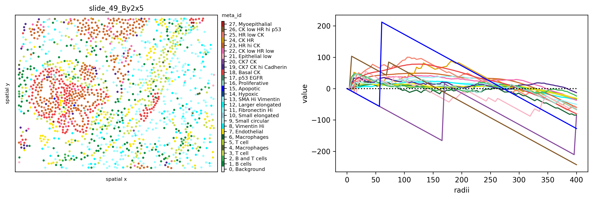
    


In the plot above we can see how all cell types except `15` and `20` cluster on smaller distances (radii in pixel). Spatial cluster analysis scores quantify the degree of spatial clustering or dispersion of different phenotypes as a function of distance, revealing a strong clustering of Apoptotic cells at a short distance (high deviation from 0 for the $L(t)-t$), clustering of Basal CK and Myoepithelial cells at medium distance and dispersion at higher distance, and random distribution of immune and stromal cells ($L(t)-t$ close to 0).

### Modularity


```python
for spl in all_samples:
    ath.graph.build_graph(so, spl, builder_type='knn', mask_key='cellmasks')
    ath.metrics.modularity(so, spl, 'cell_type_id')
so.spl.loc[all_samples, 'modularity_cell_type_id_res1']
```


    core
    slide_49_By2x5    0.423157
    slide_59_Cy7x7    0.216871
    slide_59_Cy7x8    0.338307
    slide_59_Cy8x1    0.334125
    slide_7_Cy2x2     0.430619
    slide_7_Cy2x3     0.381590
    slide_7_Cy2x4     0.143625
    Name: modularity_cell_type_id_res1, dtype: float64


```python
fig, axs = plt.subplots(1,2, figsize=(10,8))
ath.pl.spatial(so, 'slide_7_Cy2x2', 'cell_type_id', ax=axs[0], edges=True, graph_key='knn')
ath.pl.spatial(so, 'slide_7_Cy2x4', 'cell_type_id', ax=axs[1], edges=True, graph_key='knn')
```


    
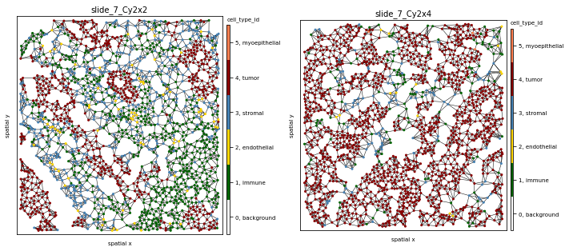
    

